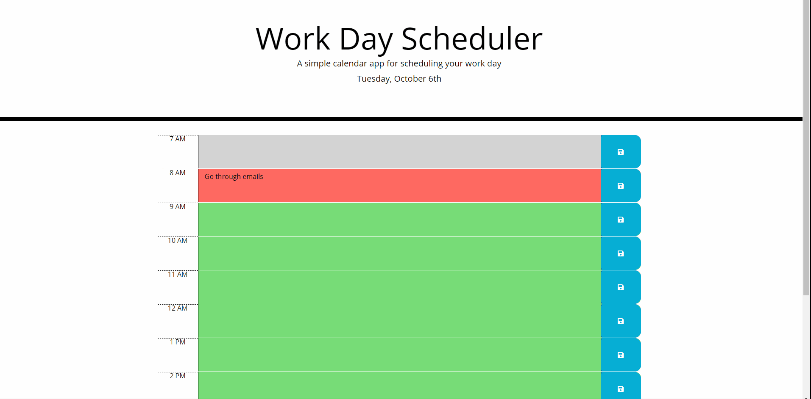

# Homework 5: Third-Party APIs: Work Day Scheduler
Homework 5

* You can take a look at the [project page](https://github.com/ndelaire/work_day_scheduler)
* View the [deployed GitHub page](https://ndelaire.github.io/work_day_scheduler/)

## Table of Contents
* Project Overview
* Frameworks
* License
* Contact

## Project Overview 

The purpose of this project is to build a calendar application that allows a user to save an event for each hour of the day from the HTML and CSS provided. The app runs in the browser and is a combination of HTML, CSS and jQuery. The current day is displayed at the top of the calendar and there are time blocks for each hour that a user can fill in. The time blocks are color coded to notate if it is the past, present, or future. The user can select the time block and enter in an event for the day, once they click save, it is saved to local storage. 

## Frameworks 

Bootstrap and jQuery 

## License 
None at this time

## Contact
* Nadine Delaire - ndelaire16@gmail.com 
* Project Link: https://ndelaire.github.io/work_day_scheduler/